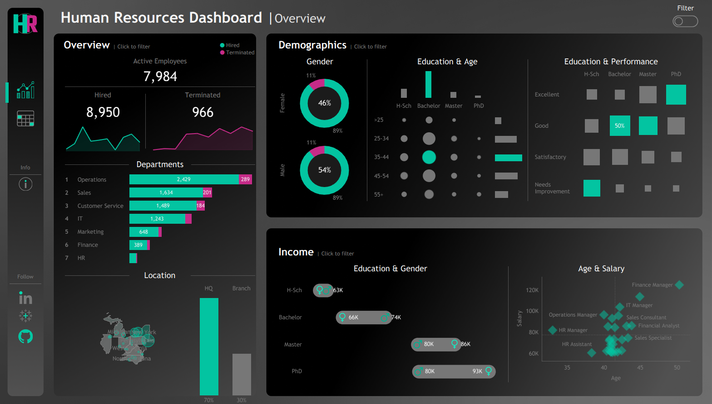

# Human Resources Analytics Dashboard

This project presents an interactive **HR Analytics Dashboard** built using **Tableau** to help decision-makers analyze workforce data, track employee lifecycle trends, and evaluate organizational performance. The dashboard provides insights into employee demographics, hiring and termination patterns, compensation, and role-based distribution across departments.

---

## 📸 Dashboard Preview

---

## 🎯 Objectives
- Monitor **hiring vs termination trends**
- Understand **department-wise workforce distribution**
- Analyze **age, gender, and education demographics**
- Evaluate **performance in relation to education level**
- Explore and compare **salary variations** by role, age, and education
- Allow HR users to **search and filter individual employee records**

---

## 📂 Dataset Information
The dataset contains anonymized employee data with the following fields:

| Category | Fields |
|---------|--------|
| Demographics | Age, Gender, Education Level |
| Job Information | Job Title, Department, Hire Date, Termination Status |
| Location | City, State, Worksite (HQ/Branch) |
| Compensation | Salary |
| Performance | Performance Rating |

Data was cleaned and structured before visualization.

---

## 🖥️ Dashboard Features

### 1. **Overview**
- Total Active Employees
- Hires vs Terminations over time
- Employee Distribution per Department
- Workforce by Location (HQ vs Branch Offices)

### 2. **Demographics**
- Gender distribution
- Age groups comparison across education levels
- Education vs Performance evaluation patterns

### 3. **Income & Compensation**
- Salary comparison by **Gender & Education Level**
- Scatter Plot: **Age vs Salary** with job roles highlighted
- Income progression per qualification level

### 4. **Employee Directory (Detailed View)**
- Searchable and filterable employee list
- Filters include:
  - Department, Job Title, Age Group, Gender
  - Salary Range, Location, Education Level
  - Length of Employment
- Displays:
  - Name, Role, Salary, Location, Hire Date, Experience Duration

---

## 🛠️ Tools & Technologies
| Tool | Purpose |
|------|---------|
| Tableau | Dashboard creation & visualization |
| Excel / CSV | Preprocessing and data structuring |
| Calculated Fields | Derived metrics and interactive filtering |

---

## 🔍 Key Insights (Examples)
- The **Operations** department holds the largest share of employees.
- Most employees are in the **Bachelor degree** education tier.
- Salary tends to increase with **both education level and experience**.
- Performance ratings vary noticeably across education categories.

---

## 🚀 Future Improvements
- Add predictive employee attrition analysis
- Integrate satisfaction / engagement survey data
- Automate data refresh with Tableau Server or Cloud

---

## 🔗 Project Link
**Tableau Public:** 

https://public.tableau.com/app/profile/youssef.eissa8870/viz/HRDashboard_17603031271170/HRSummary
